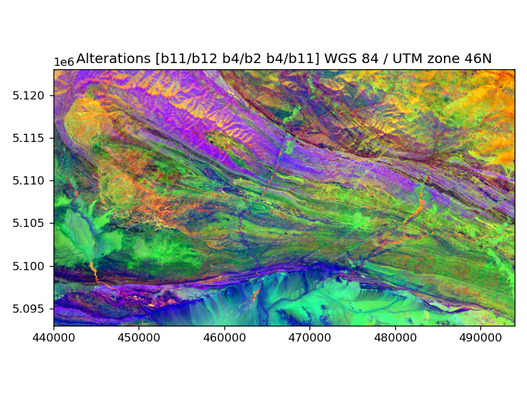
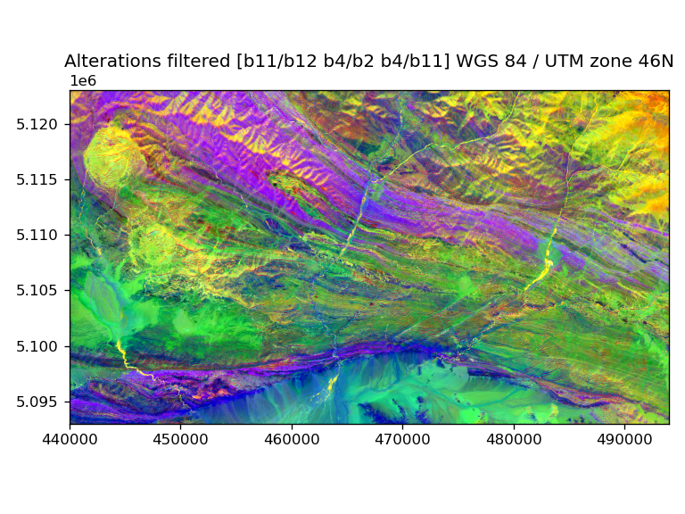

=====
Usage
=====

Start by downloading Sentinel-2 Level-2A or Level-1C product in SAFE format (e.g. from |COAH| and unzip. Open Python prompt in *s2lx* environment and import classes from `s2lx`:

.. code-block:: python

    from s2lx import *

Open SAFE data:

.. code-block:: python

    >>> s = SAFE('/path/to/safename.SAFE/MTD_MSIL2A.xml')

You can preview whole scene:

.. code-block:: python

    >>> s.preview()

Clip region of interest (note that bounds are defined in coordinate system of scene) and store in `S2` collection:

.. code-block:: python

    >>> bounds = (440000, 5093000, 494000, 5123000)  # (minx, miny, maxx, maxy)
    >>> d = s.clip(bounds, name='My Region')

To see the list of bands:

.. code-block:: python

    >>> d.bands
    ['b11', 'b12', 'b2', 'b3', 'b4', 'b5', 'b6', 'b7', 'b8']

Individual bands could ba accessed as properties:

.. code-block:: python

    >>> d.b4.show()

.. image:: images/b4.png
  :width: 640
  :alt: show band

You can use `Composite` class to create RGB composite:

.. code-block:: python

    >>> rgb = Composite(d.b4, d.b3, d.b2, name='True Color')
    >>> rgb.show()

or:

.. code-block:: python

    >>> rgb = Composite(d.b12, d.b11, d.b8, name='False Color')
    >>> rgb.show()

Bands and composites could be saved to GeoTIFF with `save` method:

.. code-block:: python

    >>> d.b4.save('b4.tif')
    >>> rgb.save('truecolor.tif')

Bands support simple mathematical operations (addition, subtraction, division, multiplication)

.. code-block:: python

    >>> alt = Composite(d.b11/d.b12, d.b4/d.b2, d.b4/d.b11, name='Alterations')
    >>> alt.show()

Bands could be filtered (check `s2lx.s2filters` for possible filters):

.. code-block:: python

    >>> medfilter = median_filter(radius=4)
    >>> b12f = d.b12.apply(medfilter)

You can do PCA analysis using `S2.pca` method:

.. code-block:: python

    >>> p = d.pca()

To create RGB composite from first three principal components:

.. code-block:: python

    >>> pca = Composite(p.pc0, p.pc1, p.pc4, name='PCA')
    >>> pca.show()

You can use also PCA to filter your data, i.,e. use only few PC to reconstruct dataset. Here we remove last four (from 9) components with lowest explained variance and reconstruct all bands:

.. code-block:: python

    >>> r = d.restored_pca(remove=(5,6,7,8))
    >>> altr = Composite(r.b11/r.b12, r.b4/r.b2, r.b4/r.b11, name='Alterations filtered')
    >>> altr.show()

.. |COAH| raw:: html

   <a href="https://scihub.copernicus.eu" target="_blank">Copernicus Open Access Hub</a>